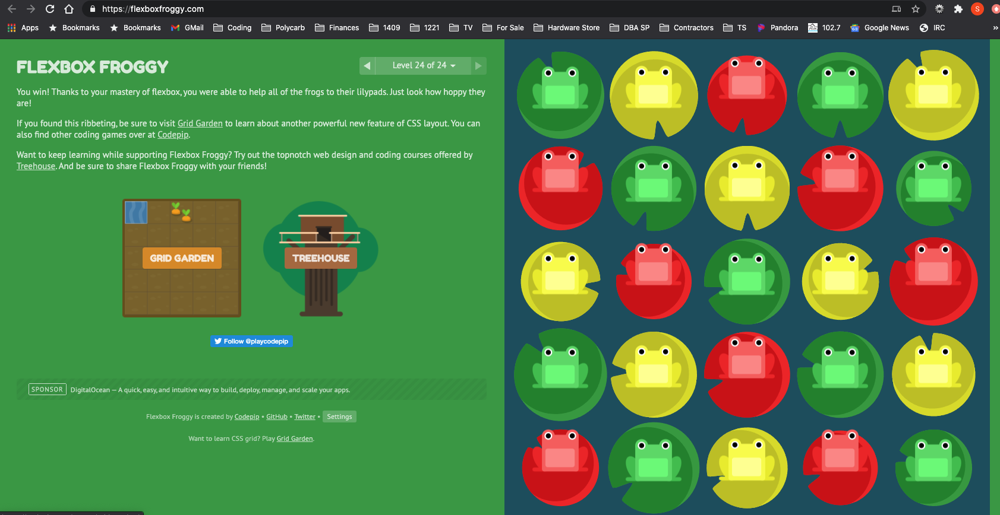

# Code 301: Class 03 - Mustache and Flexbox

***

## Read: [Templating with Mustache](https://medium.com/@1sherlynn/javascript-templating-language-and-engine-mustache-js-with-node-and-express-f4c2530e73b2)

- Templating is an efficient way to render client-side views by using JSON data
  - HTML markup with added templating tags
- Mustache is a logic-less template syntax
  - Example: `Mustache.render("Hello, {{name}}", {name:"Sherlynn"});` *Returns: Hello, Sherlynn*

- To install Mustache-express: $ npm install mustache --save

## Read: [A Guide to Flexbox](https://css-tricks.com/snippets/css/a-guide-to-flexbox/)

- Parent properties *defines a flex container, enables a flex context for all its direct children*
- Default is to layout flex items in source order, using the `order` property allows user to change the order
- `flex-direction` *establishes the main-axis*
- `flex-grow` *defines ability of a flex item to grow if necessary, defined by a proportional number relative to other flex children*
- `flex-wrap` *default is to fit all flex items on one line, `wrap` will allow items to flow on to next line*
- `flex-shrink` *similar and opposite to flex-grow, no negative numbers*
- `flex-flow` *shorthand for `flex-direction` and `flex-wrap`*
- `flex-basis`*defines the default size of an element before the remaining space is distributed*
- `justify-content` *defines the alignment along the main axis*
- `flex` *shorthand for flex-grow, flex-shrink, flex-basis*
- `align-self` *specifies alignment for an individual flex item*
- `align-items` *defines the default layout along the cross axis*
- `align-content` *aligns a flex container's lines within if there is extra space in the cross-axis*

## Read: [Flexbox Froggy](https://flexboxfroggy.com/)

- Completed all steps of this fun and informative tutorial!

## Reference: [Mustache.js Official Documentation](https://github.com/janl/mustache.js)

- Mustache template is a string that contains any number of mustache tags
  - Tags are surrounded by double curly braces: `{{tag}}`
  - Section begins with a `#` and ends with a `/`
    - Example: `{{#person}} begins a person section, while {{/person}}`
    - If the `person` keyword is `null`, `undefined`, `false`, `0`, `NaN`, `''`, or an empty list, block will not be rendered
    
***

[Return to reading-notes Deployed Site](https://simon-panek.github.io/reading-notes/)

[Return to reading-notes Mark Down](https://github.com/simon-panek/reading-notes)
